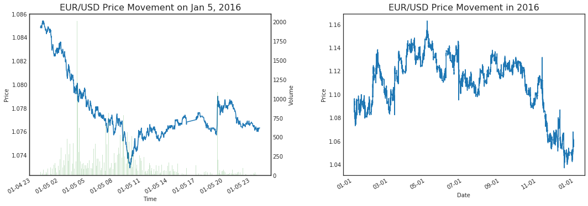
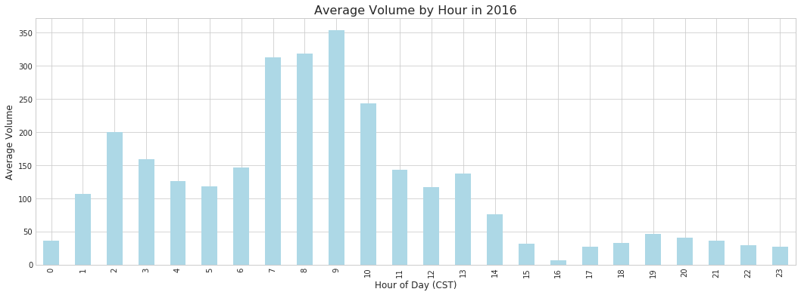
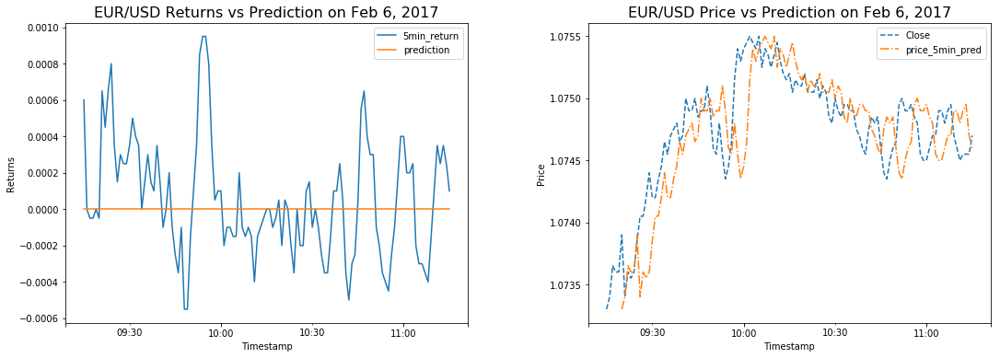

<h1 align="center">Predicting EUR/USD with LSTM Network</h1> 
<h3 align="center">Bradley Droegkamp</h3> 

# Introduction
***
Forex price prediction, much like stock price prediction, is a near impossible task given all the noise involved in price time series data.  However, profitable trading strategies can be made from models that provide only a sliver of edge.  In this analysis I will attempt to forecast price, provide a basic backtesting framework for evaluating models, and show some of the challenges associated with forecasting.

As for modeling and data, I will use a Long Short-Term Memory (LSTM - http://colah.github.io/posts/2015-08-Understanding-LSTMs/) network to predict the 5 minute future price of the front month EUR/USD futures contract (EU) listed on the Chicago Mercantile Exchange (CME - https://www.cmegroup.com/trading/fx/g10/euro-fx.html).  The model will focus on a small subset of trading hours (9:15 - 11:15AM CST).
<br>

# Data
***
The data set consists of 1-minute increment front-month EU price data from September 27, 2009 to April 18, 2018, though we will only use a subset. The data was purchased from a vendor of CME intraday data.  Note the data contains all open hours of trading, which is a 23 hour trading day of 17:00(t-1) - 16:00 CST Monday(Sunday PM) to Friday.

### Contract Details
<table class="cmeSpecTable" summary="Contract Specifications Product Table" cellspacing="0" cellpadding="2">
<tbody>
<tr>
<td class="prodSpecAtribute">Contract Unit</td>
<td colspan="5" style="text-align:left">125,000 euro</td>
</tr>
<tr>
<td class="prodSpecAtribute" rowspan="1">Trading Hours</td>
<td colspan="3" style="text-align:left">Sunday - Friday 6:00 p.m. - 5:00 p.m. (5:00 p.m. - 4:00 p.m. Chicago Time/CT) with a 60-minute break each day beginning at 5:00 p.m. (4:00 p.m. CT)</td>
</tr>
<tr>
<td class="prodSpecAtribute" rowspan="1">Minimum Price Fluctuation*</td>
<td colspan="3" style="text-align:left">Outrights: .00005 USD per EUR increments ($6.25 USD).<br />Consecutive Month Spreads: (Globex only)&nbsp;&nbsp;0.00001 USD per EUR (1.25 USD)<br />All other Spread Combinations: &nbsp;0.00005 USD per EUR (6.25 USD)</td>
</tr>
<tr>
<td class="prodSpecAtribute">Product Code</td>
<td colspan="5" style="text-align:left">CME Globex: 6E<br />CME ClearPort: EC<br />Clearing: EC</td>
</tr>
<tr>
<td class="prodSpecAtribute" rowspan="1">Listed Contracts</td>
<td colspan="5" style="text-align:left">Contracts listed for the first 3 consecutive months and 20 months in the March quarterly cycle (Mar, Jun, Sep, Dec)</td>
</tr>
<tr>
<td class="prodSpecAtribute">Settlement Method</td>
<td colspan="5" style="text-align:left">Deliverable</td>
</tr>
<tr>
<td class="prodSpecAtribute" rowspan="1">Termination Of Trading</td>
<td colspan="5" style="text-align:left">9:16 a.m. Central Time (CT) on the second business day immediately preceding the third Wednesday of the contract month (usually Monday).</td>
</tr>
<tr>
<td class="prodSpecAtribute">Settlement Procedures</td>
<td colspan="5" style="text-align:left">Physical Delivery<br /><a href="http://www.cmegroup.com/confluence/display/EPICSANDBOX/Euro" target="_blank">EUR/USD Futures Settlement Procedures&nbsp;</a></td>
</tr>
</tbody>
</table>

*Source:  https://www.cmegroup.com/trading/fx/g10/euro-fx_contract_specifications.html*

**Min Price Fluctuation changed from 0.0001 to 0.00005 on January 11, 2016 (https://www.cmegroup.com/trading/fx/half-tick.html)*

<br>

#### I.  Bring in the raw data.


```python
# The code was removed by Watson Studio for sharing.
```

    Waiting for a Spark session to start...
    Spark Initialization Done! ApplicationId = app-20190226181440-0001
    KERNEL_ID = 204b3c5b-e2ff-4cc6-a01e-f15190f40151
    +----------+-----+------+------+------+------+------+
    |      Date| Time|  Open|  High|   Low| Close|Volume|
    +----------+-----+------+------+------+------+------+
    |09/27/2009|18:00|  1.47|1.4701| 1.469|1.4691|   441|
    |09/27/2009|18:01|1.4691|1.4691|1.4689| 1.469|    29|
    |09/27/2009|18:02| 1.469| 1.469|1.4688|1.4688|    22|
    |09/27/2009|18:03|1.4687|1.4691|1.4687|1.4691|    38|
    |09/27/2009|18:04|1.4692|1.4693|1.4692|1.4692|    20|
    |09/27/2009|18:05|1.4692|1.4693| 1.469|1.4691|    11|
    |09/27/2009|18:06|1.4691|1.4692|1.4689|1.4692|    14|
    |09/27/2009|18:07|1.4691|1.4691| 1.469| 1.469|     6|
    |09/27/2009|18:08| 1.469|1.4691| 1.469|1.4691|     5|
    |09/27/2009|18:09| 1.469|1.4692| 1.469|1.4692|     7|
    |09/27/2009|18:10|1.4692|1.4692|1.4684|1.4685|    81|
    |09/27/2009|18:11|1.4686|1.4687|1.4683|1.4686|    63|
    |09/27/2009|18:12|1.4687|1.4688|1.4686|1.4687|     7|
    |09/27/2009|18:13|1.4687|1.4692|1.4687|1.4691|    25|
    |09/27/2009|18:14| 1.469|1.4691|1.4684|1.4688|    37|
    |09/27/2009|18:15|1.4686|1.4689|1.4686|1.4688|    66|
    |09/27/2009|18:16|1.4688|1.4688|1.4685|1.4686|    29|
    |09/27/2009|18:17|1.4685|1.4687|1.4683|1.4687|    20|
    |09/27/2009|18:18|1.4686|1.4688|1.4686|1.4688|     4|
    |09/27/2009|18:19|1.4687|1.4689|1.4687|1.4688|    10|
    +----------+-----+------+------+------+------+------+
    only showing top 20 rows
    
    

#### II.  Combine Date and Time columns.  Also, these times are in EST, but I prefer CST.


```python
from pyspark.sql.functions import unix_timestamp, from_unixtime, concat, col, lit, hour, minute, year, lag
from pyspark.sql.window import Window
import pandas as pd
import numpy as np
import datetime

# Convert Date and Time columns to Timestamps and combine
df_raw_2 = df_raw.select(unix_timestamp(concat(col('Date'), lit(' '), col('Time')), 'MM/dd/yyyy HH:mm')\
                   .cast(TimestampType()).alias('Timestamp'),
                   'Open', 'High', 'Low', 'Close', 'Volume')

# now substract hour from EST timestamps for CST
df = df_raw_2.select(from_unixtime(unix_timestamp(col('Timestamp')) - 60 * 60).alias('Timestamp'),
                    'Open', 'High', 'Low', 'Close', 'Volume')

df.createOrReplaceTempView('df')
df_2016 = spark.sql("SELECT * FROM df WHERE Timestamp BETWEEN '2016-01-01' AND '2016-12-31' ORDER BY Timestamp")

df_2016.show()

# pandas df for exploring at next step
pdf_plt = df_2016.toPandas()
pdf_plt.index = pd.to_datetime(pdf_plt.Timestamp)
pdf_plt.drop(['Timestamp'], axis=1, inplace=True)
```

    +-------------------+------+------+------+------+------+
    |          Timestamp|  Open|  High|   Low| Close|Volume|
    +-------------------+------+------+------+------+------+
    |2016-01-03 17:00:00|1.0884|1.0886|1.0882|1.0883|   215|
    |2016-01-03 17:01:00|1.0884|1.0884|1.0881|1.0882|    48|
    |2016-01-03 17:02:00|1.0883|1.0884|1.0882|1.0883|    37|
    |2016-01-03 17:03:00|1.0884|1.0884|1.0879|1.0879|    51|
    |2016-01-03 17:04:00|1.0878|1.0878|1.0873|1.0874|   133|
    |2016-01-03 17:05:00|1.0874|1.0875|1.0874|1.0875|    47|
    |2016-01-03 17:06:00|1.0875|1.0877|1.0874|1.0876|    24|
    |2016-01-03 17:07:00|1.0876|1.0876|1.0875|1.0876|    10|
    |2016-01-03 17:08:00|1.0876|1.0876|1.0876|1.0876|     3|
    |2016-01-03 17:09:00|1.0875|1.0875|1.0874|1.0874|    40|
    |2016-01-03 17:10:00|1.0875|1.0875|1.0873|1.0875|   146|
    |2016-01-03 17:11:00|1.0875|1.0877|1.0874|1.0876|   195|
    |2016-01-03 17:12:00|1.0877|1.0877|1.0877|1.0877|     6|
    |2016-01-03 17:13:00|1.0876|1.0876|1.0876|1.0876|    10|
    |2016-01-03 17:14:00|1.0877|1.0877|1.0877|1.0877|    23|
    |2016-01-03 17:15:00|1.0877|1.0877|1.0876|1.0876|     3|
    |2016-01-03 17:16:00|1.0877|1.0877|1.0877|1.0877|     8|
    |2016-01-03 17:17:00|1.0877|1.0879|1.0877|1.0879|    21|
    |2016-01-03 17:18:00|1.0878|1.0878|1.0876|1.0877|    29|
    |2016-01-03 17:19:00|1.0877|1.0877|1.0876|1.0876|    37|
    +-------------------+------+------+------+------+------+
    only showing top 20 rows
    
    

#### III.  Explore Data

As expected, prices are not stationary.  We will use returns rather than price to get unbiased results from our model.


```python
import seaborn as sns
import matplotlib.dates as mdates
import matplotlib.pyplot as plt
%matplotlib inline

pdf_day = pdf_plt[(pdf_plt.index >= '2016-01-05') & (pdf_plt.index < '2016-01-06')]
sns.set_style("white")

fig, ax = plt.subplots(1, 2, figsize=(18, 6))
fig.subplots_adjust(wspace=0.3)
pdf_day['Close'].plot(ax=ax[0])
ax[0].set_xlabel("Time")
ax[0].get_figure().autofmt_xdate()
xfmt = mdates.DateFormatter('%H:%M')
ax[0].xaxis.set_major_formatter(xfmt)
ax[0].set_ylabel("Price")
ax[0].set_title("EUR/USD Price Movement on Jan 5, 2016", fontsize=16)
ax2_sub1 = ax[0].twinx()
ax2_sub1.set_ylabel('Volume')
ax2_sub1.bar(pdf_day.index, pdf_day['Volume'], color='g', alpha=0.2, width = 0.5 / 1400)

pdf_plt['Close'].plot(ax=ax[1])
ax[1].set_xlabel("Date")
ax[1].get_figure().autofmt_xdate()
xfmt = mdates.DateFormatter('%m-%d')
ax[1].xaxis.set_major_formatter(xfmt)
ax[1].set_ylabel("Price")
ax[1].set_title("EUR/USD Price Movement in 2016", fontsize=16)
ax[1].get_figure().autofmt_xdate()

```





Volumes are more concentrated during US daytime hours.


```python
sns.set_style("whitegrid")
ax = pdf_plt.groupby(pdf_plt.index.hour)['Volume'].mean().plot.bar(figsize=(18, 6), color='lightblue', title="")
ax.set_xlabel("Hour of Day (CST)", fontsize=12)
ax.set_ylabel("Average Volume", fontsize=12)
ax.set_title("Average Volume by Hour in 2016", fontsize=16)
```


    Text(0.5,1,'Average Volume by Hour in 2016')





#### IV.  Set up data for next steps

Define functions for streamlined data processing


```python
from pyspark.sql import functions as F
from sklearn.preprocessing import RobustScaler
sc_f = RobustScaler()
sc_y = RobustScaler()

def add_price_returns(df, x):
    '''
    Parameters: Pyspark df with "Close" price column, x minute parameter
    Returns: Pyspark df with added x price_xmin_return column
    '''
    df_return = df.withColumn('tmp_lag_price', lag(df.Close, count=x).over(Window.orderBy('Timestamp')))
    col_name = 'price_' + str(x) + 'min_return'
    df_return = df_return.withColumn(col_name, df_return.Close - df_return.tmp_lag_price).na.drop()
    return df_return.drop('tmp_lag_price')

def get_dates_times_subset(df, startYear, endYear, st, et):
    '''
    BE SURE TO INCLUDE ALL NEEDED DATA IN TIMESPAN!  
    Building forecast_window and prior time_window from this data should be considered.
    Parameters: Pyspark df with Timestamp column, startYear(YYYY), endYear(YYYY), start time (st), end time (et)
    Returns: Pyspark df between specified dates, specific times
    '''
    df_return = df.filter((year('Timestamp') >= lit(startYear)) & (year('Timestamp') <= lit(endYear)))\
                  .filter((hour('Timestamp') >= lit(st.hour)) & (hour('Timestamp') <= lit(et.hour)))\
                  .filter((hour('Timestamp') != lit(st.hour)) | (minute('Timestamp') >= lit(st.minute)))\
                  .filter((hour('Timestamp') != lit(et.hour)) | (minute('Timestamp') <= lit(et.minute)))
    return df_return

def add_dataset_check_col(df, startTime, endTime):
    '''
    Parameters: Pyspark df with Timestamp column, startTime(HH:MM), endTime(HH:MM)
    Returns: Pyspark df with "is_in_dataset" column, identifying rows that stay in dataset after final setup
    '''
    st = datetime.datetime.strptime(startTime, '%H:%M')
    et = datetime.datetime.strptime(endTime, "%H:%M")
    df_return = df.withColumn('is_in_dataset', ((hour('Timestamp') == lit(st.hour)) & (minute('Timestamp') >= lit(st.minute))) | \
                                        ((hour('Timestamp') == lit(et.hour)) & (minute('Timestamp') <= lit(et.minute))) | \
                                        ((hour('Timestamp') >= lit(min(st.hour + 1, et.hour))) & \
                                         (hour('Timestamp') <= lit(max(et.hour - 1, st.hour)))))
    return df_return

def get_arrays_for_lstm(df, time_window, forecast_window, batch_size):
    '''
    Assumes cols 5, 6 are price, volume features, 7 will be y var, and last col is datacheck bool
    Parameters: Pyspark df, time_window, forecast_window, batch_size
    Returns: Transformed 3D X and y np arrays for LSTM network model
    '''
    pdf = df.toPandas()
    
    # only need price returns and volumes, but keep dataset check vals for below
    feature_set = pdf.iloc[:, 5:7].values
    y_set = pdf.iloc[:, 7:8].values
    is_in_dataset_check = pdf.iloc[:, -1]

    # feature scaling
    feature_set_scaled = sc_f.fit_transform(np.float64(feature_set))
    y_set_scaled = sc_y.fit_transform(np.float64(y_set))

    # filter data into needed arrays
    x_price_train = []
    x_volume_train = []
    y_train = []

    length = len(feature_set_scaled)
    for i in range(0, length):
        x_volume_train.append(feature_set_scaled[max(0, i - time_window):i, 0])
        x_price_train.append(feature_set_scaled[max(0, i - time_window):i, 1])

    for i in range(0, len(y_set_scaled)):
        y_train.append(y_set_scaled[max(0, i-forecast_window):max(0, i-forecast_window)+1, 0])

    # now that we have the time_window data, remove unwanted entries based on prior is_in_dataset_check
    x_volume_train, x_price_train, y_train, is_in_dataset_check = \
        np.array(x_volume_train), np.array(x_price_train), np.array(y_train), np.array(is_in_dataset_check)
    x_volume_train = x_volume_train[is_in_dataset_check]
    x_price_train = x_price_train[is_in_dataset_check]
    y_train = y_train[is_in_dataset_check]

    # reduce size of dataset to be divisible by batch size
    x_volume_train = x_volume_train[0:len(x_volume_train) - len(x_volume_train)%batch_size]
    x_price_train = x_price_train[0:len(x_price_train) - len(x_price_train)%batch_size]
    y_train = y_train[0:len(y_train) - len(y_train)%batch_size]

    # combine and reshape for modeling
    x_volume_train = np.reshape(np.array(x_volume_train.tolist()), (x_volume_train.shape[0], 10))
    x_price_train = np.reshape(np.array(x_price_train.tolist()), (x_price_train.shape[0], 10))
    X_train = np.dstack((x_price_train, x_volume_train))
    y_train = np.reshape(np.array(y_train.tolist()), (y_train.shape[0], 1))
    print("Feature set shape (standardized price & volume w/10min window): ")
    print(X_train.shape)
    print(X_train[0])
    print('\n')
    print("y var shape (standardized 5min future price return): ")
    print(y_train.shape)
    print(y_train[0])
    print('\n')
    return X_train, y_train

def get_mlr_df(df, time_window, forecast_window):
    '''
    DOES NOT STANDARDIZE VARIABLES!
    Parameters: Pyspark df (with Timestamp, price_1min_return, Volume, and price_5min_return, is_in_dataset cols), 
                time_window, forecast_window
    Returns: Pyspark df with cols "sma_price", "sma_volume", "y_price"
    '''
    # add sma cols for price returns and volume (features)
    df_return = df.withColumn('sma_price', F.avg("price_1min_return")\
                              .over(Window.orderBy('Timestamp').rowsBetween(-time_window, 0)))
    df_return = df_return.withColumn('sma_volume', F.avg("Volume")\
                                     .over(Window.orderBy('Timestamp').rowsBetween(-time_window, 0)))
    
    # shift 5 min return col to line up y var
    df_return = df_return.withColumn('label', \
                                     lag(df.price_5min_return, count=-forecast_window).over(Window.orderBy('Timestamp')))

    # now that we have the time_window data, remove unwanted entries based on prior is_in_dataset_check
    df_return = df_return.filter(df.is_in_dataset)

    return df_return.drop('Open', 'High', 'Low', 'Close', 'Volume', 'price_1min_return', 'price_5min_return', 'is_in_dataset')
```

##### Data will be filtered to 9:15 - 11:15AM CST
 - Common economic releases between 7:15 - 9:00AM CST may bias data if included.
 - These are generally periods of higher volume and volatility.
 - This can be revisited for building models with specific time slots.
 - Train data set will be 2013 - 2015, validation data 2016, and 2017 for test data.

<br>

At this point, we will also define:
 - Lookback **Time window** used in the LSTM = **10 minutes**
 - **Batch size** = **64**
 - **Forecast window** = **5 minutes**


```python
# define important data parameters
forecast_window = 5
time_window = 10
batch_size = 64
start_time = '09:15'
end_time = '11:15'

# add price returns columns
df = add_price_returns(df, 1)
df = add_price_returns(df, 5)

# set train data to year 2013-2015 (val data to 2016, test data to 2017)
# include only data between needed time windows (start to end time, plus time, forecast windows added accordingly)
st = datetime.datetime.strptime(start_time, '%H:%M') - datetime.timedelta(minutes = time_window)
et = datetime.datetime.strptime(end_time, '%H:%M') + datetime.timedelta(minutes = forecast_window)
df_train = get_dates_times_subset(df, 2013, 2015, st, et)
df_val   = get_dates_times_subset(df, 2016, 2016, st, et)
df_test  = get_dates_times_subset(df, 2017, 2017, st, et)

# add a column to later filter out fields not needed in final dataset.
df_train = add_dataset_check_col(df_train, start_time, end_time)
df_val   = add_dataset_check_col(df_val, start_time, end_time)
df_test  = add_dataset_check_col(df_test, start_time, end_time)

df_train.show(10, False)
```

    +-------------------+------+------+------+------+------+----------------------+----------------------+-------------+
    |Timestamp          |Open  |High  |Low   |Close |Volume|price_1min_return     |price_5min_return     |is_in_dataset|
    +-------------------+------+------+------+------+------+----------------------+----------------------+-------------+
    |2013-01-02 09:05:00|1.3266|1.3267|1.3265|1.3265|167   |-9.999999999998899E-5 |0.0                   |false        |
    |2013-01-02 09:06:00|1.3266|1.3267|1.3265|1.3266|225   |9.999999999998899E-5  |0.0                   |false        |
    |2013-01-02 09:07:00|1.3266|1.3266|1.3264|1.3265|299   |-9.999999999998899E-5 |-1.9999999999997797E-4|false        |
    |2013-01-02 09:08:00|1.3264|1.3264|1.3263|1.3263|313   |-1.9999999999997797E-4|-3.9999999999995595E-4|false        |
    |2013-01-02 09:09:00|1.3263|1.3263|1.3261|1.3261|184   |-1.9999999999997797E-4|-4.999999999999449E-4 |false        |
    |2013-01-02 09:10:00|1.3262|1.3265|1.3261|1.3265|323   |3.9999999999995595E-4 |0.0                   |false        |
    |2013-01-02 09:11:00|1.3265|1.3267|1.3264|1.3267|231   |1.9999999999997797E-4 |9.999999999998899E-5  |false        |
    |2013-01-02 09:12:00|1.3268|1.3269|1.3266|1.3266|508   |-9.999999999998899E-5 |9.999999999998899E-5  |false        |
    |2013-01-02 09:13:00|1.3267|1.3267|1.3265|1.3265|185   |-9.999999999998899E-5 |1.9999999999997797E-4 |false        |
    |2013-01-02 09:14:00|1.3266|1.3266|1.3265|1.3265|165   |0.0                   |3.9999999999995595E-4 |false        |
    +-------------------+------+------+------+------+------+----------------------+----------------------+-------------+
    only showing top 10 rows
    
    

##### Set up data using Close price and Volume as features


```python
# get arrays for lstm network model
X_train, y_train = get_arrays_for_lstm(df_train, time_window, forecast_window, batch_size)
X_test, y_test   = get_arrays_for_lstm(df_test, time_window, forecast_window, batch_size)
X_val, y_val     = get_arrays_for_lstm(df_val, time_window, forecast_window, batch_size)
```

    Feature set shape (standardized price & volume w/10min window): 
    (93504, 10, 2)
    [[-0.5        -0.20141343]
     [ 0.5         0.00353357]
     [-0.5         0.26501767]
     [-1.          0.31448763]
     [-1.         -0.14134276]
     [ 2.          0.34982332]
     [ 1.          0.02473498]
     [-0.5         1.00353357]
     [-0.5        -0.13780919]
     [ 0.         -0.20848057]]
    
    
    y var shape (standardized 5min future price return): 
    (93504, 1)
    [-1.16666667]
    Feature set shape (standardized price & volume w/10min window): 
    (31040, 10, 2)
    [[  1.25         9.125     ]
     [  2.           4.91964286]
     [ -1.           2.45982143]
     [  1.5          2.20089286]
     [ -2.5          3.75446429]
     [ -2.           1.62946429]
     [ -1.           3.92857143]
     [ -2.25         4.95535714]
     [ -4.25        10.80803571]
     [  0.5          5.25892857]]
    
    
    y var shape (standardized 5min future price return): 
    (31040, 1)
    [ 3.125]
    Feature set shape (standardized price & volume w/10min window): 
    (31168, 10, 2)
    [[ -0.5          1.06167401]
     [ -1.5          2.42731278]
     [ -1.           0.85903084]
     [  0.5          3.84140969]
     [ -0.5          1.11894273]
     [ -1.5          7.25991189]
     [ -2.          11.62995595]
     [  0.           1.22026432]
     [ -2.5          3.42290749]
     [ -2.5          3.18942731]]
    
    
    y var shape (standardized 5min future price return): 
    (31168, 1)
    [-1.]
    

##### Finally, get data for Linear Regression benchmark model

 - Since our time_window for the LSTM model is 10 minutes, we'll use a **10 minute simple moving average (SMA) of both close price and volume** as features to predict 5 minute future returns for the MLR model.


```python
# these will be kept in a pySpark dataframe so we can later show off a Pipeline assembly in Spark
mlr_train = get_mlr_df(df_train, time_window, forecast_window)
mlr_test  = get_mlr_df(df_test, time_window, forecast_window)

mlr_train.show(10, False)
```

    +-------------------+----------------------+------------------+----------------------+
    |Timestamp          |sma_price             |sma_volume        |label                 |
    +-------------------+----------------------+------------------+----------------------+
    |2013-01-02 09:15:00|-9.09090909090809E-6  |240.63636363636363|-6.999999999999229E-4 |
    |2013-01-02 09:16:00|-9.09090909090809E-6  |242.45454545454547|-6.999999999999229E-4 |
    |2013-01-02 09:17:00|-2.7272727272724268E-5|257.6363636363636 |-5.999999999999339E-4 |
    |2013-01-02 09:18:00|-5.4545454545448536E-5|263.0             |-1.9999999999997797E-4|
    |2013-01-02 09:19:00|-6.363636363637681E-5 |294.0             |-9.999999999998899E-5 |
    |2013-01-02 09:20:00|-2.7272727272724268E-5|335.0             |-9.999999999998899E-5 |
    |2013-01-02 09:21:00|-7.272727272726472E-5 |321.09090909090907|3.9999999999995595E-4 |
    |2013-01-02 09:22:00|-9.09090909090809E-5  |323.0             |3.9999999999995595E-4 |
    |2013-01-02 09:23:00|-8.18181818181728E-5  |289.45454545454544|4.999999999999449E-4  |
    |2013-01-02 09:24:00|-9.090909090910108E-5 |295.45454545454544|8.000000000001339E-4  |
    +-------------------+----------------------+------------------+----------------------+
    only showing top 10 rows
    
    

# Methodology
***
### I.  Fit the LSTM network model


```python
# this needs to be refit when back on Watson (and validate MLR model label inputs)

from keras.layers import Dense, Dropout, Input, LSTM
from keras.models import Sequential, load_model
import h5py

lstm = Sequential()
lstm.add(LSTM(40, batch_input_shape=(batch_size,time_window,2), return_sequences=True, recurrent_dropout = 0.1))
lstm.add(LSTM(30, recurrent_dropout = 0.2))
lstm.add(Dropout(0.2))
lstm.add(Dense(20, activation='relu'))
lstm.add(Dropout(0.2))
lstm.add(Dense(5, activation='relu'))
lstm.add(Dense(1))
lstm.compile(loss= 'mae', optimizer= 'adam')
lstm_history = lstm.fit(X_train, y_train, epochs=5, batch_size=batch_size, shuffle=True, validation_data=(X_val, y_val))

lstm.save(filepath="lstm.h5")
```

    Train on 93504 samples, validate on 31168 samples
    Epoch 1/5
    93504/93504 [==============================] - 54s 581us/step - loss: 0.5761 - val_loss: 0.6755
    Epoch 2/5
    93504/93504 [==============================] - 51s 551us/step - loss: 0.5758 - val_loss: 0.6758
    Epoch 3/5
    93504/93504 [==============================] - 52s 556us/step - loss: 0.5758 - val_loss: 0.6758
    Epoch 4/5
    93504/93504 [==============================] - 52s 557us/step - loss: 0.5756 - val_loss: 0.6759
    Epoch 5/5
    93504/93504 [==============================] - 52s 557us/step - loss: 0.5756 - val_loss: 0.6756
    

### I.  Fit Linear Regression Model


```python
from pyspark.ml.feature import VectorAssembler
from pyspark.ml.feature import Normalizer
from pyspark.ml.regression import LinearRegression
from pyspark.ml import Pipeline

# set up pipeline to define features, standardize, and instantiate Linear Regression model
vectorAssembler = VectorAssembler(inputCols=["sma_price", "sma_volume"], outputCol="features")
normalizer = Normalizer(inputCol="features", outputCol="features_norm", p=1.0)
lr = LinearRegression(maxIter=10, regParam=0.3, elasticNetParam=0.8)
pipeline = Pipeline(stages=[vectorAssembler, normalizer,lr])

# fit LR model
lr_model = pipeline.fit(mlr_train)

lr_model.save("lr_model.h5")
```

### II.  Compare Mean Absolute Error on Test Data

Based on this metric, it appears the Linear Regression model outperformed the LSTM network model **(BUT SEE RESULTS SECTION)**


```python
from sklearn.metrics import mean_absolute_error
from pyspark.ml.evaluation import RegressionEvaluator

lstm_pred = lstm.predict(X_test, batch_size=batch_size)
lstm_mae = mean_absolute_error(sc_y.inverse_transform(y_test), sc_y.inverse_transform(lstm_pred))

lr_pred = lr_model.transform(mlr_test)
mae_eval = RegressionEvaluator().setMetricName("mae") .setPredictionCol("prediction").setLabelCol("label")
lr_mae = mae_eval.evaluate(lr_pred)

print('LSTM Mean Absolute Error (Test set): ' + str(round(lstm_mae, 5)))
print(' MLR Mean Absolute Error (Test set): ' + str(round(lr_mae, 5)))
```

    LSTM Mean Absolute Error (Test set): 0.00034
     MLR Mean Absolute Error (Test set): 0.00028
    

# Results
***
### Both models fit test data *well* with MLR model outperforming...
 - <strong style="color:red">BUT predictions appear to lag</strong>
 - Returns are constant around 0
 - The 5 minute ahead predictions tend to be near equal to existing price.
   - Unfortunately, that shows us price forecasting is difficult!
   - The low MAE (< 3 EUR/USD pips) was deceiving.  This is more accurately a volatility metric of actual price.


```python
# at this point, I've reached my usage limit on IBM Watson Studio, 
# so I'm going to recreate the LSTM model above outside of Watson Studio.
import seaborn as sns
import matplotlib.dates as mdates
import matplotlib.pyplot as plt
%matplotlib inline

# this is ugly due to methods when shifting between Spark when in Watson studio, and not
# had to reshift price_5min_return and resize df in order to lineup with predictions
df_test_2 = df_test
df_test_2['5min_return'] = df_test_2['price_5min_return'].shift(-5)
df_test_2 = df_test_2[df_test_2.is_in_dataset][0:len(sc_y_test.inverse_transform(lstm_pred))]
df_test_2['prediction'] = sc_y_test.inverse_transform(lstm_pred)
df_test_2['price_5min_pred'] = df_test_2['Close'] + df_test_2['prediction']

# pick random day that isn't start of year where very uncommonly low volume exists
df_2017_02_06 = df_test_2[(df_test_2.index >= '2017-02-06') & (df_test_2.index <= '2017-02-07')]

fig, ax = plt.subplots(1, 2, figsize=(18, 6))
fig.subplots_adjust(wspace=0.3)
df_2017_02_06['5min_return'].plot(ax=ax[0])
df_2017_02_06['prediction'].plot(ax=ax[0])
ax[0].set_ylabel("Returns")
ax[0].set_title("EUR/USD Returns vs Prediction on Feb 6, 2017", fontsize=16)
ax[0].legend()

df_2017_02_06['Close'].plot(ax=ax[1], linestyle='--')
df_2017_02_06['price_5min_pred'].shift(5).plot(ax=ax[1], linestyle='-.')
ax[1].set_ylabel("Price")
ax[1].set_title("EUR/USD Price vs Prediction on Feb 6, 2017", fontsize=16)
ax[1].legend()
```


    <matplotlib.legend.Legend at 0x2f3265eada0>





### Alternatively, a classification metric can be created to assess and compare model accuracy

Accuracy:  Prediction Direction Correct / Total


```python
# Accuracy, as calculated based on  (Prediction Direction Correct / Total), here for LSTM and LR
df_test_2['direction_correct'] = df_test_2['5min_return'] * df_test_2['prediction'] > 0
print('Model Direction Accuracy: ' + str(round(df_test_2['direction_correct'].mean()*100, 2)) + '%')
```

    Model Direction Accuracy: 47.59%
    

# Discussion
***
### Can a pricing model offer profit opportunities?
 - Not this one.
   - Picking a direction correct < 50% of the time is not good.  On this time scale, likely need to be > 51%.
 - A basic Backtester can answer this
   - Backtester will enter long position if price return > **threshold**, short if price return < **threshold**, and get flat if back to price return reverts to 0.
   - Parameters include:
     - **threshold**: This is specified above.
     - **slippage**: Amount of payup to enter a trade beyond closing price.  Should consider bid/ask spread and transaction costs. 
     

### Considerations
 - ****Improve the existing model****
   - Optimize hyperparameters, LSTM layers, ...
     - Great link for taking advantage of talos library to do this:  https://alphascientist.com/hyperparameter_optimization_with_talos.html
   - Add relevant variables like features from related products that have leading information.
   - Consider different variable transformations that handle outliers differently.
 - ****Predict something more predictable****
  - Price of a single asset is akin to a random walk.
  - Similar framework can be used to find more achievable models like
    - Volatility
    - Spreads / Pairs
    - Portfolio relationships (like this:  https://www.econstor.eu/bitstream/10419/157808/1/886576210.pdf)

# Conclusion
***
Price forecasting is difficult.  It is convenient for a modeler to trick themselves into thinking they have an excellent pricing model based on a low error metrics, but these often simply predict a lagged price, thus offer little/no profit opportunities.   

However, this framework can provide an excellent start for more successful future models such as spread or volatility forecasting.  Efforts can be expanded and parellelized to much larger datasets given the bulk of the architecture working with Spark.

If interested in learning more about Deep Learning, this was a project completed based on the IBM Advanced Data Science Program on Coursera:  https://www.coursera.org/specializations/advanced-data-science-ibm
